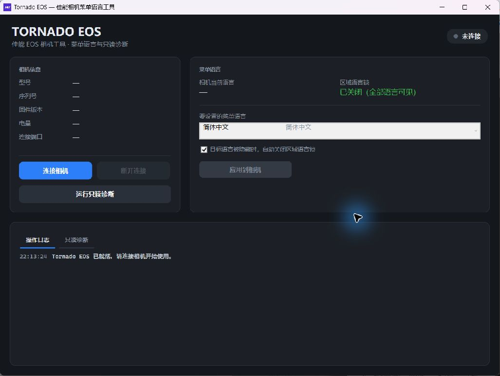

# Tornado EOS — 佳能相机菜单语言与诊断工具

一个面向中文用户的 Windows 桌面应用，使用 C#、.NET 8 和 WPF 开发。它可以通过 USB/WPD 连接佳能 EOS 相机，读取真实的型号、序列号、固件版本与电量，并提供安全的只读诊断能力。

[English](README.en.md)



## 先说明最重要的限制

真实相机连接与设备信息读取已经实现，但**真机菜单语言修改和区域语言锁解除尚未实现**。

原因是 Windows WPD 和佳能公开 EDSDK 都没有提供菜单语言写入接口。真实服务工具依赖未公开、与机型强相关的 USB/PTP 服务模式协议及固件属性地址；在 EOS R50 上猜测地址可能损坏固件。因此，本项目不会向真机发送未经验证的写入命令。

应用会明确区分真实能力与模拟演示：

| 后端 | 连接并读取设备信息 | 设置菜单语言 |
| --- | --- | --- |
| `WpdCameraBackend`（默认） | ✅ 真实 USB/WPD 读取 | ❌ 明确提示不支持 |
| `SimulatedCameraBackend` | ✅ 模拟 EOS R50 | ✅ 仅模拟、安全演示 |
| `ServiceModeCameraBackend` | 尚未实现 | 尚未实现，等待经过验证的协议 |

## 中文界面

桌面应用以简体中文为默认维护语言，包括：

- 窗口标题、相机信息、连接按钮和菜单语言设置；
- 连接状态、进度、错误提示和操作日志；
- 语言列表的中文名称与原生名称；
- 只读诊断入口、摘要、报告标题与保存对话框。

语言下拉框默认选择“简体中文”。底层协议名称、属性键和操作码保留英文标识，便于和 WPD、MTP、PTP 资料对应。

## 功能

### 真实 USB/WPD 连接

点击“连接相机”后，默认后端会枚举 Windows 便携设备并查找佳能相机。找到设备后读取：

- 相机型号
- 序列号
- 固件版本
- 电池电量
- USB/WPD 连接信息

如果没有发现相机，应用会给出中文错误提示，不会自动切换为模拟数据。

### 只读相机诊断

“运行只读诊断”会收集：

- WPD / PTP 设备属性
- MTP 厂商扩展与支持的厂商操作码
- EOS 只读遥控会话事件和属性

诊断过程不会写入属性，也不会进入服务模式。报告可以复制或保存为文本文件。

也可以使用控制台探测工具：

```powershell
dotnet run --project tools/WpdProbe
```

### 模拟菜单语言流程

`SimulatedCameraBackend` 用于演示和测试完整流程：连接模拟 EOS R50、进入模拟服务模式、关闭模拟语言锁并切换菜单语言。它不会接触真实硬件。

应用内可勾选“演示模式”（默认关闭）启用该后端，无需连接真机。

## 环境要求

- Windows 10/11
- .NET 8 SDK
- 支持 USB 数据传输的线缆
- 已开机的佳能相机

WPF 应用目标框架为 `net8.0-windows`；核心库和单元测试目标框架为 `net8.0`。

## 构建与运行

```powershell
# 构建整个解决方案
dotnet build

# 运行测试
dotnet test

# 启动中文桌面应用
dotnet run --project src/TornadoEos.App

# 启动只读 WPD 探测工具
dotnet run --project tools/WpdProbe
```

如果 .NET 8 SDK 安装在当前用户目录，直接双击编译后的 `.exe` 可能提示缺少桌面运行时。建议使用 `dotnet run`，或正确设置 `DOTNET_ROOT`。

## 项目结构

```text
TornadoEos.sln
├─ src/
│  ├─ TornadoEos.Core/       与硬件无关的模型、服务和后端接口
│  ├─ TornadoEos.Hardware/   Windows WPD/MTP/EOS 只读硬件访问
│  └─ TornadoEos.App/        中文 WPF 桌面界面
├─ tools/
│  └─ WpdProbe/              只读属性探测工具
├─ tests/
│  └─ TornadoEos.Tests/      核心逻辑测试
└─ docs/                     截图、探测记录和研究资料
```

主要调用关系：

```text
MainWindow（中文 WPF）
        │ 绑定 / 命令
MainViewModel
        │
CameraService
        │
ICameraBackend
   ├─ WpdCameraBackend（真实只读连接）
   ├─ SimulatedCameraBackend（安全模拟）
   └─ ServiceModeCameraBackend（未实现）
```

## 真机写入的贡献要求

如果未来要实现真实菜单语言写入，必须同时满足：

1. 协议和属性地址经过目标机型验证，不依赖猜测；
2. 先提供完整的只读探测证据和失败保护；
3. 清楚标注支持的机型与固件版本；
4. 不把 EOS R50 之外机型的地址直接套用到 R50；
5. 提交中不得包含真实设备序列号或其他隐私信息。

中文界面的维护约定见 [CONTRIBUTING.md](CONTRIBUTING.md)。

## 许可证

[MIT](LICENSE)
